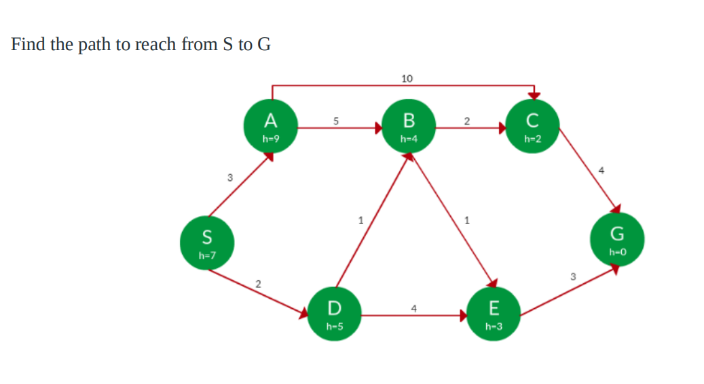

# CIA 1: Search Algorithms

This folder contains the implementation of various search algorithms for the CIA 1 assignment.

## Algorithms Implemented

1. **[British Museum Search](britishMuseumSearch.py)**:
   - This is an exhaustive search algorithm that explores every possible path in the graph until the goal is found. It is highly inefficient as it does not use any heuristic or cost information.
   
2. **[Depth-First Search (DFS)](depthFirstSearch.py)**:
   - DFS is a search algorithm that explores as far as possible along each branch before backtracking. It is useful for searching deep graphs but can get stuck in loops if cycles are present.

3. **[Breadth-First Search (BFS)](breadthFirstSearch.py)**:
   - BFS explores all nodes at the present depth level before moving on to nodes at the next depth level. It guarantees finding the shortest path in an unweighted graph. After finding a path, all the remaining nodes in the same level are explored before the algorithm terminates.

4. **[Hill Climbing Search](hillClimbing.py)**:
   - Hill Climbing is a variant of DFS and a heuristic-based search that starts at an arbitrary node and continuously moves to the neighbor node that has the lowest heuristic value. It can get stuck in local optima.

5. **[Beam Search](beamSearch.py)**:
   - Beam Search is a variant of BFS that explores only a fixed number of best paths (determined by 'Beam Width') at each level, based on a heuristic function. It sacrifices completeness for efficiency by limiting the search width.

6. **[Oracle Search](oracleSearch.py)**:
   - Oracle Search is a guided search that explores paths while pruning those paths whose cost does not improve the current best-known solution, similar to Branch and Bound.

7. **[Branch and Bound](branchAndBound.py)**:
   - Branch and Bound systematically explores all possible paths, pruning paths that exceed the best-known cost to the goal. It guarantees finding the optimal path if one exists.

8. **[Branch and Bound with Extension List](branchAndBoundWithExtensionList.py)**:
   - This variant of Branch and Bound tracks fully explored nodes using an extension list, ensuring that already-explored paths are not revisited, making the search more efficient.

9. **[Branch and Bound with Estimate Heuristics](branchAndBoundWithEstimateHeuristics.py)**:
   - This is an enhanced version of Branch and Bound, using both the actual path cost (`g(n)`) and an estimate (`h(n)`) of the cost to reach the goal, guiding the search efficiently like A\*.

10. **[A* (A-Star)](aStar.py)**:
    - A\* is a popular search algorithm that uses both the actual path cost (`g(n)`) and a heuristic estimate (`h(n)`) to find the optimal path. It guarantees finding the shortest path when the heuristic is admissible.

11. **[Best-First Search](bestFirstSearch.py)**:
    - Best-First Search is a greedy algorithm that explores the node that appears closest to the goal according to a heuristic function, without considering the actual path cost (`g(n)`).

##
The graph used to apply all the above algorithms on is 

